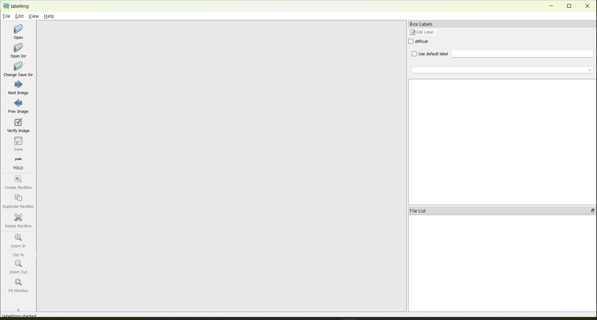

# Dataset

O Dataset nada mais é que banco de dados de imagens e fotos usadas para o treino do algoritmo.

Essa etapa é trabalhosa, uma vez que requer ações manuais como coletar e separar fotos, bem como *exige* a categorização (_labelling_) de todas as fotos.

## 1. Imagens e fotos

Inicialmente foram utilizadas imagens disponíveis na internet para treinar o algoritmo. Note que, quanto maior o banco de dados melhor será a sua acurácia (desde que o processo de _labelling_ seja uniforme).

O banco de imagens atual conta com apenas 45 imagens.

A pasta `images` concentra as imagens usadas para:

* Imagens de Treino: Armazenadas na pasta `train`, e;
* Imagens de Teste: Armazenadas na pasta `val`.

> **Observação :** Não repetir imagens no treino e no teste, as imagens devem ser **sempre** usadas uma única vez (ou no treino ou no teste). Além disso, a proporção recomendada é de 80% para treino e 20% para o teste.

## 2. _Labelling_

Este processo é o de categorização das imagens, será o momento onde um *especialista* irá delimitar digitalmente os limites dos equipamentos de segurança, tais como:

* Capacetes
* Óculos de Proteção
* Luvas
* Protetor Auricular

É mandatório que se use uma plataforma/software de gestão das marcações para se ter uma uniformidade das categorias.

Analogamente à organização das imagens, as marcações serão salvas em arquivo do tipo `.txt` em uma mesma estrutura de pastas das imagens. Desta forma, as marcações estarão armazenadas na pasta `labels`.

* Labels de Treino: Armazenadas na pasta `train`, e;
* Labels de Teste: Armazenadas na pasta `val`.

> **Observação:** Mandatoriamente os arquivos`.txt` devem ter o mesmo nome que as imagens.

## 3. Ferramenta de _Labelling_

Vamos usar o _package_ [`labelImg`](https://pypi.org/project/labelImg/) que é amplamente utilizado para realizar essa tarefa de _labelling_.

O vídeo abaixo exemplifica o uso da ferramenta.

https://www.youtube.com/watch?v=lNmqxsFCUk0

### 3.1. Instalação do `labelImg`

Abra o _prompt_ do Anaconda:

```
pip3 install labelImg
```

Após a instalação será necessário executá-lo via _prompt_ do Anaconda.

```
labelImg
```

Abrirá uma janela como essa:



## 4. YAML

O arquivo `data.yaml` é um tipo de arquivo de configuração.

* `train`: _Path_ até onde as imagens de treino estão armazenadas;
* `val`: _Path_ até onde as imagens de teste estão armazenadas;
* `nc`: Quantidade de categorias, e;
* `names`: Nome das categorias.

> **Observação:** Atenção ao nomear as categorias, pois um único caractere diferente já cria uma nova categoria.

Após a categorização de todas as imagens o `labelImg` cria automaticamente um arquivo chamado `classes.txt`, nele você encontrará todas as categorias criadas.
